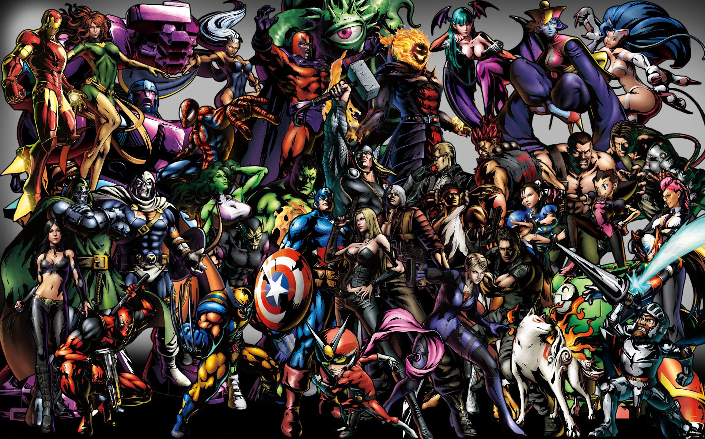

<!--
*** Thanks for checking out this project developed using golang integrated with Marvel Universe. If you have a suggestion
*** that would make this better, please fork the repo and create a pull request
*** or simply open an issue with the tag "enhancement".
*** Don't forget to give the project a star!
*** Thanks again! Now go create something AMAZING! :D
-->

# marvel-universe-web
using the Golang search the Marvel Universe Characters
 

<!-- ABOUT THE PROJECT -->
## About The Project
This project is a web based golang application that shows the information of superheroes using Marvel api.

 
 

## Run the Application using ready Docker Image
* [Ready Docker Image(v:0.4.3)](https://hub.docker.com/repository/docker/funf/marvel-universe-web)

> $ docker run -d -p 9000:9000 funf/marvel-universe-web:0.4.3

go to `http://localhost:9000` from your browser and start to explore Marvel Universe Characters.
 
 

<!-- ACKNOWLEDGMENTS -->
## Acknowledgments

Use this space to list resources you find helpful and would like to give credit to. I've included a few of my favorites to kick things off!

* [Marvel Developer Platform](https://developer.marvel.com/)
* [Marvel Development Api - Tester Docs](https://developer.marvel.com/docs)
* [Marvel Wallpaper/Image](https://wallpaperaccess.com/4k-marvel)
* [Readme Best Practices](https://github.com/othneildrew/Best-README-Template)
* [Golang helps](https://hackersandslackers.com/create-your-first-golang-app/)
* [Convert Json to Go Struct](https://mholt.github.io/json-to-go/)